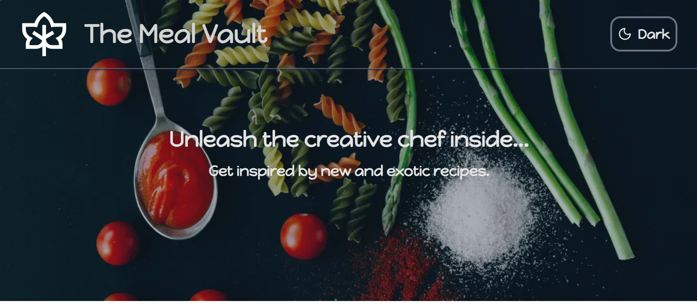

# The Meal Vault

This is a full-stack recipe discovery web app that uses Next.js, TypeScript, Tailwind CSS, and the MealDB Free APIs. It is deployed on Vercel.

## Table of contents

- [The challenge](#the-challenge)
- [Screenshot](#screenshot)
- [Links](#links)
- [Built with](#built-with)
- [What I learned](#what-i-learned)
- [Author](#author)

### The challenge

Users should be able to:

- View the optimal layout for the interface depending on their device's screen size.
- Browse recipes by cuisine, category, and region.
- Get full meal detail pages, including ingredients, directions, and embedded video tutorials.
- Toggle between dark and light theme modes.

### Screenshot

### Links

- App URL: [The Meal Vault](https://the-meal-vault.vercel.app/)

### Built with

- [Next.js](https://nextjs.org/)
- [Vercel](https://vercel.com/)
- [next-themes](https://github.com/pacocoursey/next-themes) - To toggle smoothly between light and dark modes
- [TypeScript](https://www.typescriptlang.org/)
- [Tailwind Css](https://tailwindcss.com) - For styling and responsive design
- [The Meal DB Free API](https://www.themealdb.com/api.php)
- [Shadcn UI](https://ui.shadcn.com/) - For reusable components

### What I learned

By building a complex full-stack application using Next.js, TypeScript and Tailwind CSS, I have acquired a decent production-ready skillset, that combines advanced architecture, data orchestration, performance engineering, and systematic UI design.

## Author

- Website - [Razan Mahmoud](https://github.com/Razan-Mahmoud)
- APIs - [The Meal DB Free API](https://www.themealdb.com/api.php)
- Open Source Images - [Pixabay](https://pixabay.com/) and [Pexels](https://www.pexels.com/)
